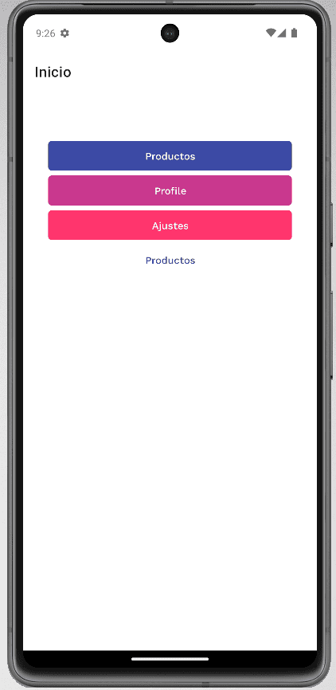
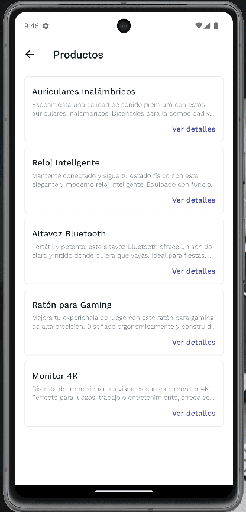

# Expo Navigation App

Aplicación móvil con **Expo Router** y **NativeWind** para practicar navegación por stacks en React Native.  
Incluye pantallas de inicio, perfil, ajustes y un catálogo de productos con rutas dinámicas.  
Proyecto educativo pensado para entender flujos de navegación, estilos con Tailwind y estructura de carpetas en Expo.

## Demos

| Inicio | Productos | Detalle |
|:---:|:---:|:---:|
|  |  |  |

## Cómo correr el proyecto

```bash
# 1. Clonar e instalar dependencias
git clone https://github.com/urian121/expo-navigation-app.git
cd expo-navigation-app
npm install

# 2. Iniciar Expo
npx expo start
```

Luego escanea el QR con **Expo Go** o presiona `a` (Android) / `i` (iOS) en la terminal.

## Stack

- Expo SDK 51
- Expo Router
- NativeWind / Tailwind CSS
- TypeScript

---

## ⭐ ¿Te sirvió este proyecto?

Si te ayudó a aprender navegación en React Native, **déjame una estrella en GitHub**.  
No cuesta nada y le da visibilidad al repo para que más personas lo encuentren.

👉 **[Dar estrella en GitHub](https://github.com/urian121/expo-navigation-app)**

¡Gracias por el apoyo! 🚀
